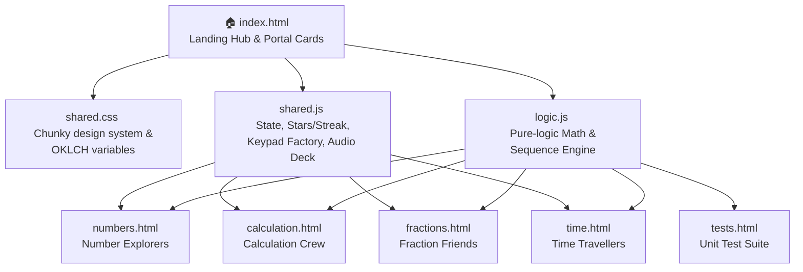

# Rainbow Learning Academy — Technical & Pedagogical Specification

This document details the architecture, features, pedagogical rationale, and code structures of the **Rainbow Learning Academy (RLA)**. It is written to serve as both a developer onboarding guide and a parent/educator manual explaining *how* and *why* each interactive system helps children build mathematical intuition.

---

## 1. Overview & Design Philosophy

Rainbow Learning Academy is a gamified, visual-first, offline-compatible maths sandbox. It translates raw digital representations (symbols, numbers, equations) into spatial representations (visual fraction strips, physical clock hand grab-handles, skip-count ladders) and linguistic layers (spoken canine narrations and case studies).

### 🕹️ The Star & Streak Reward Economy
The star and streak economy is implemented globally in [`shared.js`](file:///g:/code/RLA/shared.js) and operates under two distinct learning-theory principles:
1.  ⭐ **Stars (Cumulative Effort - Growth Mindset)**: Earning a correct answer increments the total star count by 1. Stars represent cumulative effort and are permanently saved in the browser's `localStorage` (`time_stars`). They **never reset** or decrease on incorrect answers. This models a growth mindset: all work is positive, and mistakes are simply milestones toward a higher count.
2.  🔥 **Streak (Fluency & Independence - Self-Reliance)**: The streak counter (`time_streak`) tracks consecutive correct answers. Crucially, the streak **only grows on self-reliant answers** (where the student did not click the "💡 Hint" button). Tapping a hint allows the student to earn their star but quietly freezes the streak growth. Getting an answer wrong resets the streak to 0 with a soft error chord. This incentivises careful double-checking and independent execution without punitive blockades.

### 🔊 Shuffled Audio Reinforcement Loops
Younger learners benefit from auditory cues that reflect classroom feedback patterns:
*   **Web Audio API Synthesizer**: Procedural synthesized chime chords for correct answers, soft triangle descending buzzes for incorrect tries, and ascending fanfares for level-ups. Synthesizing sounds on-the-fly ensures sub-millisecond response times and works offline without downloading heavy MP3 payloads.
*   **Ava Guide Voice loops (`tickInteraction`)**: Spoken guide phrases (`ava.mp3` series) play in a shuffled loop. To avoid auditory fatigue, a guide line is triggered randomly once every **5 to 10 interactions** (calculated by a randomized interaction deck).
*   **Tactile Doggy Barks (`playBark`)**: Clicking menus or completing drag actions triggers randomized playful barking sound effects (`bark.mp3` series) to keep the atmosphere light and positive.

---

## 2. Number Explorers (`numbers.html`)

This module introduces primary learners to the characteristics of integers from 1 to 120, linking numeric values to spatial, structural, and algebraic patterns.

---

### Mode 1: The Number Gallery
*   🎯 **Teaches**: Number definitions, classification, and math-property categorization (Primes, Composites, Squares, Cubes, Triangulars, Highly Composites).
*   🕹️ **How you play**: Scroll through a gorgeous grid of numbers 1–120. Click any number to expand a sidebar detailing its divisors, prime factors, Roman numeral translation, tally mark representation, and Collatz conjecture cycle. Toggle "Math Tints" or "Periodic Table" overlay views.
*   ⚙️ **Generation & checking**: Pre-computed statically on load inside `NUM_CACHE` in [`logic.js`](file:///g:/code/RLA/logic.js). Checking is exploratory—selecting a tile pulls its pre-computed factor record and updates the detail sidebar dynamically.
*   📈 **Difficulty / progression**: Sandbox/exploratory mode. Accessible to all ages.
*   🧠 **Why it works**: By visualising numbers with custom "tints" (e.g. coloring primes in rose, perfect squares in sky-blue), numbers cease to be arbitrary characters. Tying integers to the periodic table of elements (e.g. matching `11` to `Na` / Sodium) creates rich interdisciplinary links that appeal to kids who love encyclopedias and science.

---

### Mode 2: The Gallery Quiz
*   🎯 **Teaches**: Recognition of mathematical classes and properties (e.g., identifying primes, perfect numbers, or factors).
*   🕹️ **How you play**: Look at a generated question (e.g., *"Which of these is a Prime Number?"*) and select from four multiple-choice buttons.
*   ⚙️ **Generation & checking**: The engine grabs random numbers, queries their mathematical records in `NUM_CACHE`, and constructs multiple-choice lists with exactly one valid target and three incorrect distractors.
*   📈 **Difficulty / progression**: Gated by selected level:
    - 🌱 **Beginner**: Evens, odds, and basic comparison.
    - 🗺️ **Explorer**: Perfect squares, triangular numbers, and divisors.
    - 🏆 **Champion**: Prime numbers, Highly Composite numbers, and binary popcount properties.
*   🧠 **Why it works**: Recontextualises abstract arithmetic definitions into a gamified quiz. Distractors are specifically computed from adjacent numbers, training the child to carefully distinguish between properties (e.g., separating odd numbers from prime numbers).

---

### Mode 3: Build-a-Number
*   🎯 **Teaches**: Place value, binary representation (base 2), and powers of 2.
*   🕹️ **How you play**: Toggle a row of 8 glowing "paw-light" binary switches (representing `128, 64, 32, 16, 8, 4, 2, 1`) to sum to a target decimal number. Includes a sandbox mode to watch numbers grow or shrink in real-time as switches are flipped.
*   ⚙️ **Generation & checking**: The UI generates a target decimal number from 1 to 120. When the switches are toggled, their binary sum is calculated and compared to the target value.
*   📈 **Difficulty / progression**: The target numbers scale upward based on selected difficulty settings.
*   🧠 **Why it works**: Binary is traditionally presented as abstract computer science. By mapping bits to physical "paw-lights", children physically discover how adding powers of two can create *any* integer. The direct spatial mapping (a larger light for `64` vs a tiny light for `1`) grounds binary arithmetic visually.

---

### Mode 4: Sequences
*   🎯 **Teaches**: Algebraic patterns, difference analysis, and forecasting.
*   🕹️ **How you play**: Study a sequence of 5 numbers on a visual graph. Use the big on-screen keypad to enter the next term. Click "💡 Difference Ladder" to overlay step-differences.
*   ⚙️ **Generation & checking**: Uses `SEQ_GENERATORS` in [`logic.js`](file:///g:/code/RLA/logic.js). Shuffles linear addition, subtraction crossing zero, squares, Fibonacci, triangular, and prime progressions. Validated against the computed `next` value.
*   📈 **Difficulty / progression**: Progression scales through 3 tiers:
    - 🌱 **Beginner**: Standard count-up (diff 2, 3, 5, 10).
    - 🗺️ **Explorer**: Subtraction crossing zero, skip offsets, linear `an+b` functions.
    - 🏆 **Champion**: Perfect squares, prime arrays, Fibonacci cycles, and powers of two.
*   🧠 **Why it works**: Sequences are often frustrating because kids try to guess the answer. The **Difference Ladder** visualises the "gap" between terms as a tactile step-ladder. Revealing first- and second-level differences allows children to see the constant rates of change (like the constant second difference of perfect squares), transforming formulaic algebra into geometric visual climbing.

---

## 3. Calculation Crew (`calculation.html`)

This module builds multiplicative fluency for tables 1 through 20. It uses visual grouping and tactile skip-counting before memory testing.

---

### Mode 1: Learn (Discovery Grid)
*   🎯 **Teaches**: Core times tables (1–12 for primary, 13–20 for stretch challenges) and visual multiplication.
*   🕹️ **How you play**: Pick a table (1–20) represented by a consistent emoji identity. Explore the progression:
    - **Step A (Skip-Count)**: Tap a row of numbers to speak/highlight the multiples (e.g. `3, 6, 9, 12...`).
    - **Step B (Visual Array)**: Tap a grid of the table's dedicated emoji (e.g. 3 rows of 4 bones `🦴` for `3 × 4`) to count them.
    - **Step C (Practice)**: Answer the table's 12 equations in linear order using the custom keypad.
*   ⚙️ **Generation & checking**: Generates facts `n × 1` through `n × 12`. Keypad inputs are checked directly against `n * i`.
*   📈 **Difficulty / progression**: Linear structured pathway. Tapping through steps A and B unlocks Step C. Completing Step C awards the **Bronze Star** for that table.
*   🧠 **Why it works**: Prevents children from guessing rote facts without understanding group structures. Tapping the visual array forces the brain to link `3 × 4` to three physical groups of four objects. Tapping each item counts it, cementing the physical reality of area multiplication.

---

### Mode 2: Time Trial (Speed Run)
*   🎯 **Teaches**: Multiplicative recall and speed-based fluency.
*   🕹️ **How you play**: Solve 10 shuffled questions for a single selected table against a big running stopwatch.
*   ⚙️ **Generation & checking**: Shuffles the 12 facts of the table. Standardised keypad input is verified.
*   📈 **Difficulty / progression**: Completing the Time Trial with 10/10 correct awards the **Silver Star**. Beating a personal best time triggers PJ-pop confetti and records the time. Playful speed medals are awarded next to their best times (🐆 *Cheetah* < 15s, 🐎 *Pony* < 30s, 🐢 *Steady Walker*).
*   🧠 **Why it works**: Pressure is mitigated by a high-reward, low-penalty environment. Getting an answer wrong does *not* lock the game or fail the child; instead, it displays the correct answer instantly in a soft bubble (`"Ooh, so close! 3×4 = 12 🐾"`) and moves along. This keeps momentum high and encourages children to self-correct speed runs.

---

### Mode 3: Mixed Trial (The Ultimate Challenge)
*   🎯 **Teaches**: Cross-table flexibility and automaticity.
*   🕹️ **How you play**: Drag a slider to set the highest times table to include (up to 5, 12, or 20). Answer 10+ shuffled equations drawn randomly across all tables up to that maximum.
*   ⚙️ **Generation & checking**: Shuffles multipliers and multiplicands within the boundary set by the slider. Keypad input is checked.
*   📈 **Difficulty / progression**: Clearing a mixed trial level for the first time unlocks a **Gold Star** for the max-level. Tracks separate mixed best records.
*   🧠 **Why it works**: The slider gives children agency over their challenge level. Allowing them to choose exactly how high to mix (e.g., stopping at 5, stretching to 12, or daring to hit 20) lets them safely push their comfort boundaries step-by-step.

---

## 4. Fraction Friends (`fractions.html`)

This module develops visual part-whole intuition without abstract calculation. All modes are strictly visual comparison tools.

---

### Mode 1: Explore (Strips Sandbox)
*   🎯 **Teaches**: Fraction size relationships, parts of a whole, and denominators.
*   🕹️ **How you play**: Tap segments on a stack of color-coded fraction strips (1 whole down to 1/16) to highlight them and read their decimal/percent equivalents.
*   ⚙️ **Generation & checking**: Interactive sandbox. Tracks clicked segment states to highlight equivalent overlaps across the strip stacks.
*   📈 **Difficulty / progression**: Sandbox mode. Active strips conform to selected difficulty setting.
*   🧠 **Why it works**: A common pitfall is the belief that 1/8 is larger than 1/4 because "8 is bigger than 4". The visual sandbox physically shows that a whole divided into 8 pieces yields much smaller slices than a whole divided into 4 pieces.

---

### Mode 2: Compare
*   🎯 **Teaches**: Fractional inequality (greater than, less than, equal to).
*   🕹️ **How you play**: Inspect two visually represented fractions (e.g., `2/3` vs `3/4`) and tap the correct comparison operator button (`<`, `=`, `>`).
*   ⚙️ **Generation & checking**: Shuffles distinct fractions from the active denominator pool. Checks their computed values `a/b` vs `c/d`.
*   📈 **Difficulty / progression**: Active pools range from simple halves/thirds/quarters (🌱 Beginner) up to 1/16 and sevenths (🌈 Rainbow Quest).
*   🧠 **Why it works**: Shows interactive fraction bars under both numbers. When selected, the bars fill up gradually, letting children visually confirm *why* one is larger before they select the mathematical operator symbol.

---

### Mode 3: Sort
*   🎯 **Teaches**: Fractional ordering and relative size estimation.
*   🕹️ **How you play**: Drag and drop 3 or 4 fraction cards into a visual rack in order from **Smallest to Largest**.
*   ⚙️ **Generation & checking**: Shuffles distinct fraction combinations. Validates their floating-point sorting order.
*   📈 **Difficulty / progression**: Scales card counts and denominator variety with difficulty.
*   🧠 **Why it works**: Dragging cards physically models the spatial ordering of values on a number line. If stuck, children can look at the fraction strips panel below to estimate sizes, turning a stressful test into an active spatial lookup.

---

### Mode 4: Common Denominators (Find LCD)
*   🎯 **Teaches**: Least Common Multiple (LCM) and preparations for fraction addition.
*   🕹️ **How you play**: Look at two fractions with different denominators (e.g., `1/3` and `1/4`) and use the virtual keypad to enter their Least Common Denominator.
*   ⚙️ **Generation & checking**: Generates distinct fractions. Checks keypad inputs against the Least Common Multiple (LCM) of the two denominators.
*   📈 **Difficulty / progression**: Beginner uses friendly common denominators (e.g. 2, 4); Champion pushes coprime combinations (e.g. 5, 12).
*   🧠 **Why it works**: Features a "💡 Show Multiples" hint that lists skip-count strips for both denominators (e.g. `3, 6, 9, 12...` vs `4, 8, 12...`). The first matching multiple highlights in green, giving kids a visual discovery of the common denominator.

---

### Mode 5: Number Line
*   🎯 **Teaches**: Placing fractional values on a standard number line boundary.
*   🕹️ **How you play**: Drag a sliding handle along a number line from 0 to 1 to mark the exact location of a target fraction (e.g., `3/8`).
*   ⚙️ **Generation & checking**: Sets a target fraction. Measures the slider's drag position (percentage) against the target percentage. Allows a friendly margin of error (tolerance) that narrows on higher difficulties.
*   📈 **Difficulty / progression**:
    - 🌱 **Beginner**: Tolerance 12%.
    - 🗺️ **Explorer**: Tolerance 8%.
    - 🏆 **Champion**: Tolerance 5%.
    - 🌈 **Rainbow Quest**: Tolerance 3% (precision mastery).
*   🧠 **Why it works**: Connects the concept of "parts of a shape" to the concept of "position on a line". Showing a fill-bar option allows children to see the line fill like a progress track, mapping linear distance to fractional weight.

---

### Mode 6: Seesaw (Comparison to 1/2)
*   🎯 **Teaches**: Estimation using 1/2 as a benchmark.
*   🕹️ **How you play**: Look at a fraction (e.g., `4/10`) and decide if it is **Less than 1/2**, **Equal to 1/2**, or **Greater than 1/2** by placing it on a balancing seesaw.
*   ⚙️ **Generation & checking**: Selects a fraction. Compares `a/b` to `0.5` to determine the correct bucket.
*   📈 **Difficulty / progression**: Scales denominators. High levels include close estimations (e.g. `5/9` vs `1/2`).
*   🧠 **Why it works**: 1/2 is the ultimate mental benchmark in estimation. Tapping a bucket tips the seesaw physically. If they get it wrong, it splits the seesaw visually into two fraction bars to show why the balance tilted the way it did.

---

### Mode 7: Shrink It! (Simplify Fractions)
*   🎯 **Teaches**: Equivalent fractions and simplification using Great Common Divisor (GCD).
*   🕹️ **How you play**: Look at an unsimplified fraction (e.g., `6/8`) and use the custom virtual keypad to enter its simplest equivalent fraction (e.g., `3/4`).
*   ⚙️ **Generation & checking**: Generates fraction `a/b` where `gcd(a,b) > 1`. Checks keypad numerator and denominator inputs against the simplified form.
*   📈 **Difficulty / progression**:
    - 🌱 **Beginner**: Small denominators, easy dividers (like dividing by 2).
    - 🗺️ **Explorer**: Dens up to 8, dividing by 2, 3, or 4.
    - 🏆 **Champion**: Dens up to 12.
    - 🌈 **Rainbow Quest**: Complex simplification up to 16.
*   🧠 **Why it works**: Simplification is often taught as an abstract division drill. In **Shrink It!**, unsimplified segments shrink down on-screen to show that `6/8` covers the *exact same physical space* as `3/4`, proving that "simplifying" doesn't change the size of the fraction.

---

## 5. Time Travellers (`time.html`)

This module uses a 3-phase scaffold to teach reading the analog clock, elapsed time calculations, and scheduling.

---

### The Digital-to-Descriptive Learning Thread
Unlike traditional methods that force children to decipher complicated hand positions first, this academy anchors children in what they already know best, letting advanced concepts flow naturally from there:
1.  **Digital Grounding (Hours & Minutes)**: The journey starts with a solid, comfortable understanding of raw digital hours and minutes (e.g., `8:40`).
2.  **Analog Translation**: The student immediately visualizes how those digital numbers map to physical hands (the slow Neighborhood Walker and fast Lap Runner).
3.  **Linguistic Layering (Common Understanding)**: The student connects those numbers to common conversational tracks—learning how the digital minutes flow into the green "Past" zone or count down inside the blue "To" zone.
4.  **Practical Scheduling**: The student extends this understanding to real-world calculations (e.g., starting at `9:30`, subtracting a `10-minute` walk, and understanding why we must leave by `9:50` to arrive at school by `10:00` sharp!).

---

### Phase 1: Reinforce (Quiz Mode)
*   🎯 **Teaches**: Reading clock times, zone boundaries (Past vs To), and the Hour Neighborhood rule.
*   🕹️ **How you play**: Study a static clock face and select the correct time or descriptor from four multiple-choice options, or fill in a sentence template (e.g., *"It is [ ] minutes [to] [ ]"*).
*   ⚙️ **Generation & checking**: Generates random times. Checks selected options against calculated hour/minute states.
*   📈 **Difficulty / progression**: Shuffles multiple-choice quizzes and fill-in-the-blank sentence prompts. Unlocks Phase 2 when `phaseProgress >= 5`.
*   🧠 **Why it works**: **The Hour Neighborhood Rule** solves the classic "almost the next hour" trap (e.g. reading `8:50` as `9:50` because the hour hand is so close to the 9). The UI highlights the exact "neighborhood slice" of the current hour, physically showing that the slow hour hand resides inside the 8 neighborhood until the fast hand completes its full lap!

---

### Phase 2: Tactile (Set the Hands)
*   🎯 **Teaches**: Spatial translation of verbal descriptions onto analog clock coordinates.
*   🕹️ **How you play**: Read a written statement (e.g., *"Set the hands to quarter to 9"*) and physically drag the analog hands (or slide the control handles) to match.
*   ⚙️ **Generation & checking**: Generates written time phrases. Compares the user's dragged slider values to target hour and minute configurations.
*   📈 **Difficulty / progression**:
    - 🌱 **Beginner**: Whole and half hours.
    - 🗺️ **Explorer**: Quarters and 5-minute ticks.
    - 🏆 **Champion**: Minute-precise alignments.
*   🧠 **Why it works**: Establishes muscle memory. Dragging the fast minute hand and watching the slow hour hand crawl slowly behind it (using actual gear-ratio calculations) replicates the mechanics of a real clock. A "💡 Play Count-Up" tool demonstrates the sweep visually.

---

### Phase 3: Master (Glitter/Rainbow Quest Stories)
*   🎯 **Teaches**: Elapsed time addition/subtraction, duration calculations, and forward/backward scheduling.
*   🕹️ **How you play**: Solve procedurally calculated word stories involving character agendas (e.g., *"Hairy Maclary needs to get to the school gate by 3:15. It takes him 20 minutes to walk... when does he leave?"*). Drag the clock hands to set the answer.
*   ⚙️ **Generation & checking**: Generates random schedules and durations. Computes backward subtraction or forward addition, validating the final hand configuration.
*   📈 **Difficulty / progression**: Tiers determine complexity:
    - **Tier 1**: Friendly 5/10/15 minute durations (Beginner).
    - **Tier 2**: Coprime durations requiring hour-boundary crossings (Explorer).
    - **Tier 3**: Multi-hour elapsed schedules with carry-over math (Champion).
*   🧠 **Why it works**: Integrates mathematics into high-interest storytelling. Children are highly motivated to help their favorite dogs get to their concerts, playdates, and dinners on time. The "💡 Show Tip" hint reveals the decoder and gives scheduling clues, ensuring kids never hit a wall.

---

## 6. Shared Systems Architecture

All modules share a central codebase layer. This prevents duplicate logic, maintains design standards, and ensures persistent progression.

### 🎨 OKLCH CSS Variable Design System
The visual aesthetics are managed by a centralized CSS variable configuration in [`shared.css`](file:///g:/code/RLA/shared.css). OKLCH provides perceptually uniform colors, making theming robust:
*   `--bg`: Default deep indigo-navy base (`oklch(12% 0.04 260)` to `oklch(8% 0.03 260)`) to maintain low glare and high readability.
*   `--card`: Glassmorphism panel styling (`rgba(22, 19, 49, 0.65)`).
*   `--radius-chunky`: Chunky elements defined by `border-radius: 20px` up to `28px` to give a child-friendly, safe-corners look.
*   `--font-family`: Standardised on `'Outfit', sans-serif` globally for a rounded typography profile.
*   **Per-Area Color Accents**:
    - **Numbers**: Lagoon Blue (`#38bdf8`)
    - **Calculations**: Strawberry Pink/Red (`#fb7185`)
    - **Fractions**: Candy Orange/Yellow (`#ea580c`)
    - **Time**: Amethyst Purple (`#c084fc`)

### ⌨️ Keypad Factory (`makeKeypad`)
To prevent iOS Safari from zooming automatically when input boxes gain focus (which breaks layouts on iPads), all numerical entries are managed via a custom virtual keypad factory inside [`shared.js`](file:///g:/code/RLA/shared.js).
*   **Interaction**: Renders large finger-friendly touch buttons (`0–9`, backspace `⌫`, and check `✓`).
*   **Safety**: Binds keyboard listeners to allow standard physical keyboards to trigger buttons safely.
*   **Parameters**: Accepts custom configurations, such as allowing a negative sign switch (`allowNegative`) for countdown sequences.

### 💾 LocalStorage Map
All user progress is stored offline inside the browser:
*   `time_stars`: Cumulative count of earned stars.
*   `time_streak`: Current consecutive correct answer streak.
*   `rla_theme`: Current styling theme (`dark` / `light`).
*   `rla_muted`: Sound status boolean (`true` / `false`).
*   `tables_stars`: Tracker for times table completions `{ "3": { bronze: true, silver: false, gold: false } }`.
*   `tables_best`: Float record for Time Trial seconds per times table.
*   `tables_champion`: Mixed table clear record.
*   `tables_mixed_best`: Float record for mixed challenges.

---

## 7. Developer File & Line Code Map

For quick navigation and testing, the core architectures and calculations map to the following locations in the source files:

| File | Target / System | Line Numbers | Purpose |
| :--- | :--- | :--- | :--- |
| [`logic.js`](file:///g:/code/RLA/logic.js) | `isPrime`, `divisors` | [logic.js:13-19](file:///g:/code/RLA/logic.js#L13-L19) | Basic prime number checks and factor divisors calculation. |
| [`logic.js`](file:///g:/code/RLA/logic.js) | `happy` number check | [logic.js:82-91](file:///g:/code/RLA/logic.js#L82-L91) | Evaluates if an integer is a happy or unhappy number. |
| [`logic.js`](file:///g:/code/RLA/logic.js) | `buildNumberRecord` | [logic.js:104-138](file:///g:/code/RLA/logic.js#L104-L138) | Heavy analytical data map generation for a single integer. |
| [`logic.js`](file:///g:/code/RLA/logic.js) | `SEQ_GENERATORS` | [logic.js:176-285](file:///g:/code/RLA/logic.js#L176-L285) | Algebraic sequence algorithms with varying step formulas. |
| [`logic.js`](file:///g:/code/RLA/logic.js) | `diffLadder` | [logic.js:291-299](file:///g:/code/RLA/logic.js#L291-L299) | Computes sequence step differences at multiple levels. |
| [`shared.js`](file:///g:/code/RLA/shared.js) | `applyTheme` | [shared.js:18-23](file:///g:/code/RLA/shared.js#L18-L23) | Switches visual layout between light and dark themes. |
| [`shared.js`](file:///g:/code/RLA/shared.js) | `playBark` | [shared.js:49-54](file:///g:/code/RLA/shared.js#L49-L54) | Triggers a randomized canine barking sound effect. |
| [`shared.js`](file:///g:/code/RLA/shared.js) | `playNextAva` | [shared.js:56-62](file:///g:/code/RLA/shared.js#L56-L62) | Triggers a random spoken guiding voice line from the Ava deck. |
| [`shared.js`](file:///g:/code/RLA/shared.js) | `tickInteraction` | [shared.js:64-71](file:///g:/code/RLA/shared.js#L64-L71) | Counters interactions to execute scheduled spoken prompts. |
| [`shared.js`](file:///g:/code/RLA/shared.js) | `playSound` | [shared.js:80-118](file:///g:/code/RLA/shared.js#L80-L118) | Web Audio synthesizer producing clean game chimes/notes. |
| [`shared.js`](file:///g:/code/RLA/shared.js) | `triggerConfetti` | [shared.js:171-207](file:///g:/code/RLA/shared.js#L171-L207) | Candy-color custom canvas confetti shower simulation. |
| [`shared.js`](file:///g:/code/RLA/shared.js) | `showAnswerModal` | [shared.js:210-248](file:///g:/code/RLA/shared.js#L210-L248) | Overlay answer dialog detailing corrections or successes. |
| [`shared.js`](file:///g:/code/RLA/shared.js) | `bumpCorrect` / `Wrong` | [shared.js:262-276](file:///g:/code/RLA/shared.js#L262-L276) | Increments stars, recalculates streaks, and plays feedback. |
| [`shared.js`](file:///g:/code/RLA/shared.js) | `initRpj` | [shared.js:286-368](file:///g:/code/RLA/shared.js#L286-L368) | Controls floating behavior of Rainbow PJ mascot on success. |
| [`shared.js`](file:///g:/code/RLA/shared.js) | `initMascotHover` | [shared.js:371-417](file:///g:/code/RLA/shared.js#L371-L417) | Pop-up quote cards displaying canine dialogue on text hover. |
| [`shared.js`](file:///g:/code/RLA/shared.js) | `makeKeypad` | [shared.js:422-478](file:///g:/code/RLA/shared.js#L422-L478) | Renders virtual keypad and listens for keyboard key presses. |
| [`shared.js`](file:///g:/code/RLA/shared.js) | `showIntroModal` | [shared.js:481-500](file:///g:/code/RLA/shared.js#L481-L500) | Welcome prompt introducing each canine narrator's quest. |
| [`tests.html`](file:///g:/code/RLA/tests.html) | `Test Suite` | [tests.html:25-214](file:///g:/code/RLA/tests.html#L25-L214) | Evaluates safe integers, shuffling, and rule calculations. |
